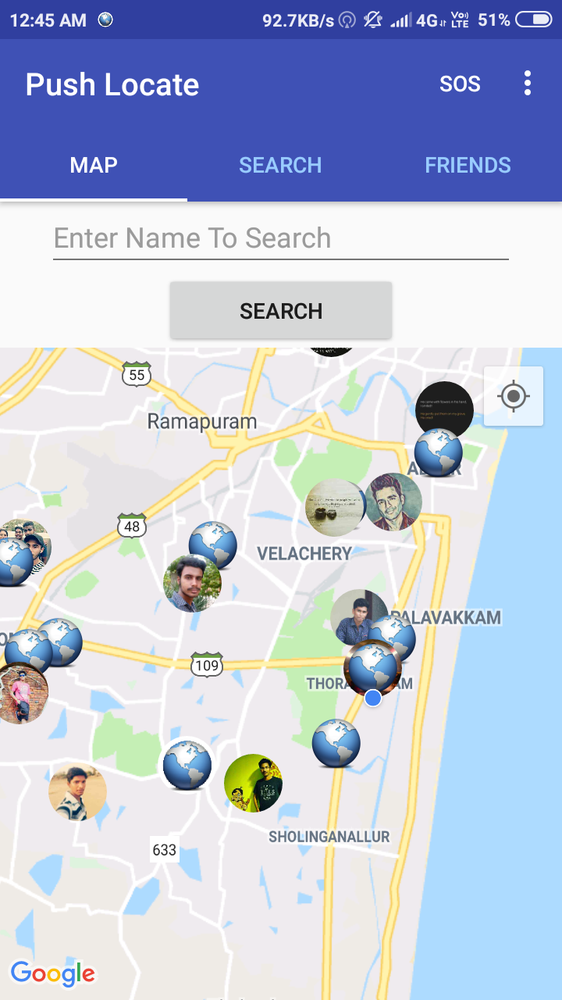
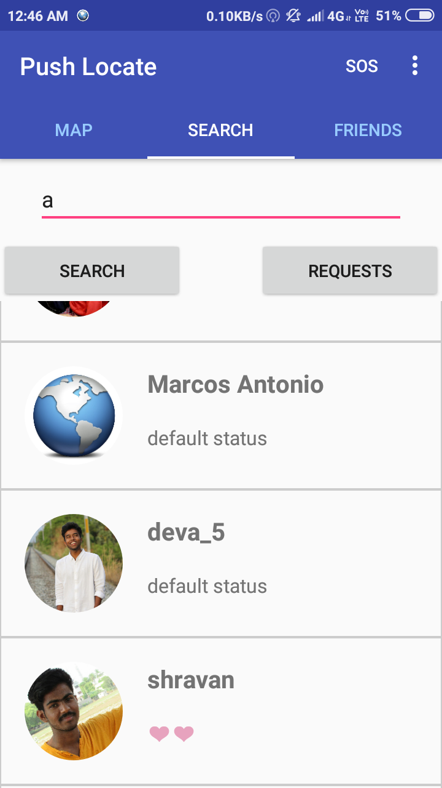
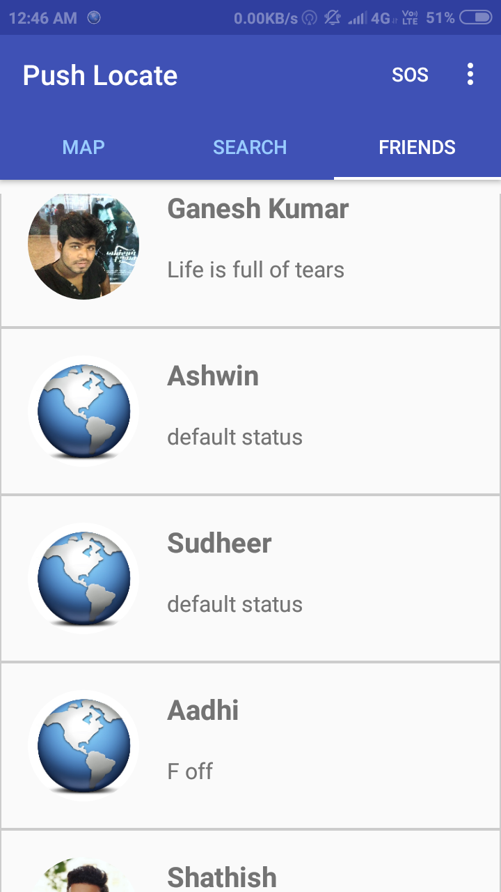
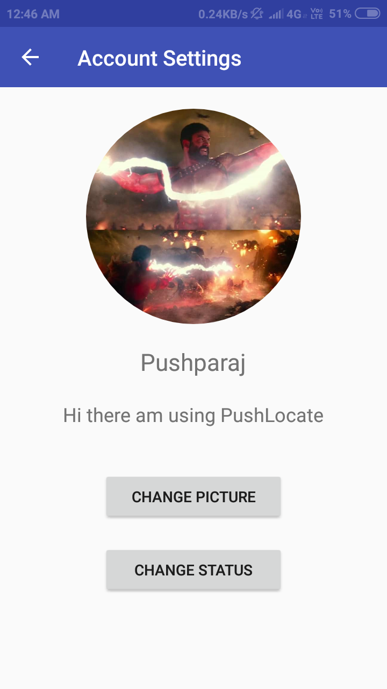
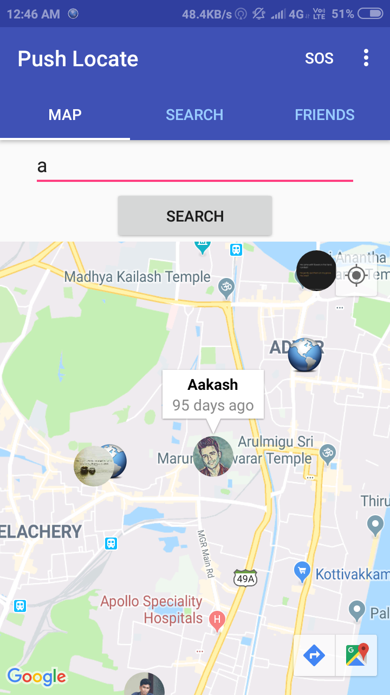

# About this app

This app was built as a learning exercise to master android development. This application is a localtion based social app.

# Technical stack

1. Google maps api
1. Firebase realtime database
1. Firebase authentication
1. Firebase cloud messaging
1. Android sdk

# Project description

The user is verified using firebase email authentication. User can change his profile picture and status from settings page. He/She can search for other users and give them friend requets. Upon approval they will be able to see the friend's location in the maps page.

# Screenshots

# License

This project is licensed under MIT license.

